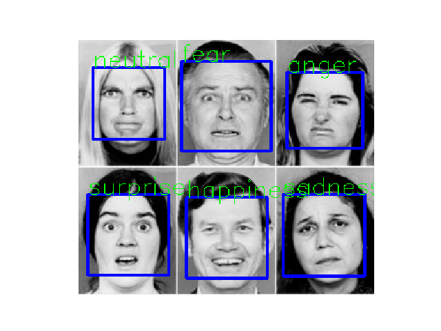

# Facial-Emotion-Recognition-PyTorch-ONNX

## Dataset
### 1. [FER2013](https://www.kaggle.com/c/challenges-in-representation-learning-facial-expression-recognition-challenge/data)
<p>
The data consists of 48x48 pixel grayscale images of faces. The faces have been automatically registered so that the face is more or less centered and occupies about the same amount of space in each image. The task is to categorize each face based on the emotion shown in the facial expression in to one of seven categories (0=Angry, 1=Disgust, 2=Fear, 3=Happy, 4=Sad, 5=Surprise, 6=Neutral).</p>
<p>
The training set consists of 28,709 examples. The public test set used for the leaderboard consists of 3,589 examples. The final test set, which was used to determine the winner of the competition, consists of another 3,589 examples.
</p>

  
  
  Some labels of FER2013 may not be accepted as the prefect label by everyone, so microsoft released an updated [labels](https://raw.githubusercontent.com/microsoft/FERPlus/master/fer2013new.csv) for the dataset called FERPLUS.

### 2. [FERPLUS](https://github.com/microsoft/FERPlus)
  Top label : FER2013 </br>
  Bottom label : FERPLUS
  
  

## Model
### 1. Baseline CNN
  ```python
  class Face_Emotion_CNN(nn.Module):
    def __init__(self):
      super(Face_Emotion_CNN, self).__init__()
      self.cnn1 = nn.Conv2d(in_channels=1, out_channels=8, kernel_size=3)
      self.cnn2 = nn.Conv2d(in_channels=8, out_channels=16, kernel_size=3)
      self.cnn3 = nn.Conv2d(in_channels=16, out_channels=32, kernel_size=3)
      self.cnn4 = nn.Conv2d(in_channels=32, out_channels=64, kernel_size=3)
      self.cnn5 = nn.Conv2d(in_channels=64, out_channels=128, kernel_size=3)
      self.cnn6 = nn.Conv2d(in_channels=128, out_channels=256, kernel_size=3)
      self.cnn7 = nn.Conv2d(in_channels=256, out_channels=256, kernel_size=3)
      self.relu = nn.ReLU()
      self.pool1 = nn.MaxPool2d(2, 1)
      self.pool2 = nn.MaxPool2d(2, 2)
      self.cnn1_bn = nn.BatchNorm2d(8)
      self.cnn2_bn = nn.BatchNorm2d(16)
      self.cnn3_bn = nn.BatchNorm2d(32)
      self.cnn4_bn = nn.BatchNorm2d(64)
      self.cnn5_bn = nn.BatchNorm2d(128)
      self.cnn6_bn = nn.BatchNorm2d(256)
      self.cnn7_bn = nn.BatchNorm2d(256)
      self.fc1 = nn.Linear(1024, 512)
      self.fc2 = nn.Linear(512, 256)
      self.fc3 = nn.Linear(256, 7)
      self.dropout = nn.Dropout(0.3)
      self.log_softmax = nn.LogSoftmax(dim=1)

    def forward(self, x):
      x = self.relu(self.pool1(self.cnn1_bn(self.cnn1(x))))
      x = self.relu(self.pool1(self.cnn2_bn(self.dropout(self.cnn2(x)))))
      x = self.relu(self.pool1(self.cnn3_bn(self.cnn3(x))))
      x = self.relu(self.pool1(self.cnn4_bn(self.dropout(self.cnn4(x)))))
      x = self.relu(self.pool2(self.cnn5_bn(self.cnn5(x))))
      x = self.relu(self.pool2(self.cnn6_bn(self.dropout(self.cnn6(x)))))
      x = self.relu(self.pool2(self.cnn7_bn(self.dropout(self.cnn7(x)))))

      x = x.view(x.size(0), -1)

      x = self.relu(self.dropout(self.fc1(x)))
      x = self.relu(self.dropout(self.fc2(x)))
      x = self.log_softmax(self.fc3(x))
      return x

    def count_parameters(self):
      return sum(p.numel() for p in self.parameters() if p.requires_grad)
  ```
### 2. Model Pretrained with Face Data

### 3. Attention Model

## Training
- Model was trained for 140 epochs
- Adam optimizer with manual lr scheduling [100 : 1e-3, 120 : 1e-4, 140 : 1e-5]

## Model Metrics
  ### 1. Baseline CNN
  |                	    | Training Set 	| Public Test Set 	| Private Test Set 	|
  |----------------	    |--------------	|-----------------	|------------------	|
  | Accuracy Score 	    |     0.855    	|    0.7945       	|     0.7803       	|
  | F1 (wgt avg)  	    |     0.86     	|    0.80          	|     0.78         	|
  | Precision (wgt avg) |     0.86     	|    0.80          	|     0.78         	|
  | Recall (wgt avg)    |     0.86     	|    0.80          	|     0.79         	|

  
  ### 2. Model Pretrained with Face Data
  |                	    | Training Set 	| Public Test Set 	| Private Test Set 	|
  |----------------	    |--------------	|-----------------	|------------------	|
  | Accuracy Score 	    |     0.855    	|    0.7945       	|     0.7803       	|
  | F1 (wgt avg)  	    |     0.86     	|    0.80          	|     0.78         	|
  | Precision (wgt avg) |     0.86     	|    0.80          	|     0.78         	|
  | Recall (wgt avg)    |     0.86     	|    0.80          	|     0.79         	|
  
  ### 3. Attention Model
  |                	    | Training Set 	| Public Test Set 	| Private Test Set 	|
  |----------------	    |--------------	|-----------------	|------------------	|
  | Accuracy Score 	    |     0.855    	|    0.7945       	|     0.7803       	|
  | F1 (wgt avg)  	    |     0.86     	|    0.80          	|     0.78         	|
  | Precision (wgt avg) |     0.86     	|    0.80          	|     0.78         	|
  | Recall (wgt avg)    |     0.86     	|    0.80          	|     0.79         	|
  
  
## Deployment
### Image 
```
cd PyTorch
python FER_image.py --path='test_img/test.jpg'
```


### Live Cam(OpenCV)

### ONNX
The PyTorch Model is converted to a Tensorflow graph with ONNX and it is deployed with Tensorflow.js as a JavaScript Application.


